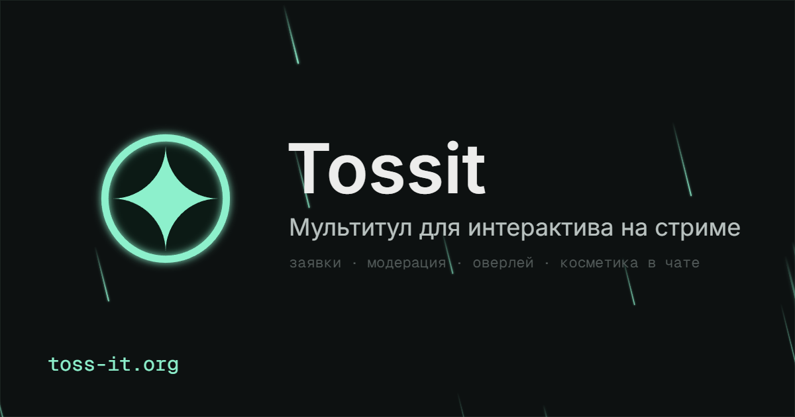

<p align="center">
  
</p>

<p align="center">
  A <strong>submissions inbox for streamers</strong> — viewers send images, GIFs, videos and sounds<br />
  straight to your stream, with moderation, a whitelist and limits.
</p>

<p align="center">
  <a href="https://toss-it.win"><strong>🌐 toss-it.win</strong></a>
</p>

<p align="center">
  
  
  
  
  
</p>

---

## What is it

Tossit lets your viewers throw media onto your stream. They open your link, drop a file (or a
YouTube link, or text), and it shows up in your OBS overlay — once it clears moderation. It's a
lightweight, transparent alternative to media-alert tools: minimal steps from "opened the page"
to "sent something", and the streamer stays in control of what goes live.

Platform-agnostic — works for Twitch, Kick and YouTube streamers (it doesn't depend on any one
platform's player or events).

## Features

- 🎬 **Any media** — images, GIFs, videos and audio, plus YouTube links and plain text.
- 🛡️ **Moderation** — a swipe-based review queue, a whitelist for trusted viewers (auto-play),
  bans, and channel moderators (one-time invite links).
- 📺 **OBS overlay** — a browser-source URL that plays approved submissions on stream.
- ⏱️ **Per-channel limits** — duration, file size, viewer cooldown, hourly cap, accepting toggle.
- 🔊 **TTS** — optionally read out the sender's name and message.
- 💜 **Donation events** — listens to donation services (Donatello via webhook) to trigger overlay
  FX. Money never flows through Tossit — it reacts to events, it doesn't process payments.
- ✨ **Stardust & Founder** — a cosmetic activity currency and a Founder status via promo codes.
- 🌍 **Multi-language UI** — English, Russian and Ukrainian.
- 🔑 **Sign in** with Twitch or Google.

## How it works

```
viewer page (/c/<login>)  →  upload  →  processing  →  moderation  →  on stream (OBS overlay)
```

## Tech stack

- **Frontend** — React 19, Vite 8, Tailwind CSS 4, React Router 7, Motion. SPA with per-route SEO
  meta injected server-side.
- **Backend** — Fastify 5, Socket.IO, Drizzle ORM over SQLite (local) / Turso (prod); `sharp` +
  `ffmpeg` for media processing.
- **Monorepo** — pnpm workspaces, TypeScript everywhere.

## Project layout

```
apps/
  web/       Vite + React SPA (streamer dashboard, viewer page, landing)
  server/    Fastify API + realtime + static hosting
  overlay/   OBS browser-source overlay
packages/
  shared/    Shared TypeScript types
```

## Getting started

Requirements: Node.js, [pnpm](https://pnpm.io), and `ffmpeg` on your PATH (for media processing).

```bash
pnpm install
pnpm dev        # runs server + web + overlay together
```

- Web: http://localhost:5173 · API: http://localhost:3000 · Overlay: http://localhost:5174

Local config lives in `apps/server/.env`. Without Twitch credentials a fake-auth mode is enabled
for local development, and the database is a self-creating SQLite file — so `pnpm dev` works out of
the box. To exercise the real OAuth flow, set `TWITCH_CLIENT_ID`, `TWITCH_CLIENT_SECRET` and
`COOKIE_SECRET`.

Useful scripts (from the repo root):

```bash
pnpm -r typecheck   # typecheck every package
pnpm build          # build all
pnpm lint           # eslint
pnpm format         # prettier
```

## Contributing

Project conventions (commit style, comments, language) live in [CLAUDE.md](CLAUDE.md).
